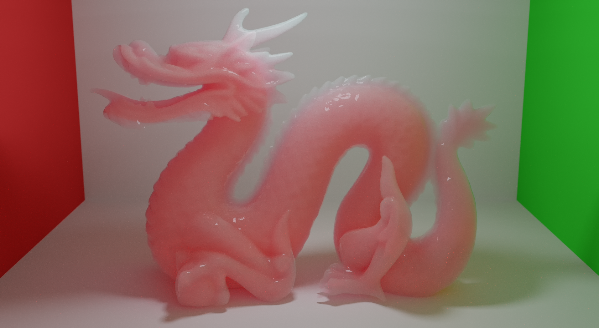

# Photorealistic-Rendering-using-OpenCL
My BSc thesis on Photorealistic rendering using OpenCL

## @ToFix
:exclamation: **Haven't found out yet how to sample the light sources inside a medium** :exclamation:
___
## Controls
__Escape__ - Exit\
__Space__ - Reset\
__WASDFR__ - Translate Camera\
__G__ - Increase Aperture Diameter\
__H__ - Decrease Aperture Diameter\
__T__ - Increase Focal Distance\
__Y__ - Decrease Focal Distance\
__Arrows__ - Yaw/Pitch\
__Prtsc__ - Export to png format
```
-width  "window's width"
-height "window's height"
-scene  "filepath of the scene you want to render"
-hdr    "filepath of the hdr you want to use"
-alpha  "enable alpha channel"
```
> [**hdrihaven**](https://hdrihaven.com/hdris/) is a great site for downloading free hi-res HDR images.

## Features
- SAH BVH
- Volumetric pathtracing (homogeneous, exponential medium)
- SDF Raymarching
- Thin lens camera
- Image-based lighting
- Alpha testing
- Media
  - Homogeneous
  - Exponential
- Phase functions
  - Isotropic
  - Henyey-Greenstein
  - Rayleigh
- Materials
  - Lambertian BRDF
  - Burley BRDF
  - Specular BRDF
  - Specular BSDF
  - Rough Dielectric (Beckmann) + Absorption
  - GGX Microfacet BRDF
  - Beckmann Microfacet BRDF
  - Specular Subsurface Scattering

## Possible Future work
- Quasi Monte Carlo
- Disney's principled, layered BRDF
- Volumetric pathtracing (heterogeneous medium)
- Volumetric pathtracing (SDF density map)
- Photon Mapping
- MIS
- Bi-Directional PT
- MLT
- Sheen BRDF
- Blinn Microfacet BRDF
- LBVH using spatial Morton codes

## How To Build

### Windows
1. Download GLFW from [here](http://www.glfw.org/download.html)
2. Download AMD_APP_SDK from [here](https://drive.google.com/open?id=1Usg9hSx-EjntZ9paoJx51MZWYDqI83Lh)
3. Use CMake GUI to configure and generate the project

### Linux
1. for Ubuntu *xenial* (16.04LTS) and later run
```bash
sudo apt-get update
sudo apt-get -y install make cmake build-essential libglew-dev libglfw3-dev nvidia-opencl-dev

mkdir build
cd build
cmake ..
make
```
2. for older versions run
```bash
echo "deb http://ppa.launchpad.net/keithw/glfw3/ubuntu trusty main" | sudo tee -a /etc/apt/sources.list
sudo apt-get update
sudo apt-get -y install make cmake build-essential libglew-dev nvidia-opencl-dev
sudo apt-get -y --allow-unauthenticated install libglfw3-dev

mkdir build
cd build
cmake ..
make
```

## Credits
[tunabrain](https://twitter.com/tunabrain) - Benedikt Bitterli\
[sebadorn](https://sebadorn.de/) - Sebastian Dorn\
[mmp](http://pharr.org/matt/) - Matt Pharr

