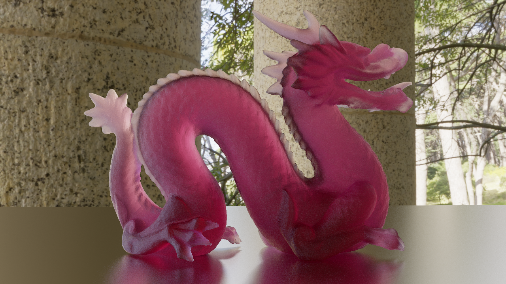

[](https://travis-ci.org/Mourtz/Photorealistic-Rendering-using-OpenCL)

## Controls
__Escape__ - Exit\
__Space__ - Reset\
__WASDFR__ - Translate Camera\
__G__ - Increase Aperture Diameter\
__H__ - Decrease Aperture Diameter\
__T__ - Increase Focal Distance\
__Y__ - Decrease Focal Distance\
__Arrows__ - Yaw/Pitch\
__Prtsc__ - Export
```
-width    "{integer}: window's width"
-height   "{integer}: window's height"
-scene    "{string}: filepath of the scene you want to render"
-hdr      "{string}: filepath of the hdr you want to use"
-alpha    "{void}: add this flag if you want to enable alpha blending"
-encoder  "{integer}: { 0: ".png", 1: ".hdr" }"
```
> [**hdrihaven**](https://hdrihaven.com/hdris/) is a great site for downloading free hi-res HDR images.

## Features
- SAH BVH
- Volumetric pathtracing (homogeneous, exponential medium)
- Multiple Importance Sampling (MIS)
- SDF Raymarching
- Thin lens camera
- Image-based lighting
- Alpha blending
- Media
  - Homogeneous
  - Exponential
- Phase functions
  - Isotropic
  - Henyey-Greenstein
  - Rayleigh
- Materials
  - Lambertian BRDF
  - Burley BRDF
  - Rough Conductor
  - Rough Dielectric + Absorption
  - Microfacet
    - GGX
    - Beckmann
    - Phong
  - Smooth/Flat shading

## Possible Future work
- Quasi Monte Carlo
- Disney's principled, layered BRDF
- Volumetric pathtracing (heterogeneous medium)
- Volumetric pathtracing (SDF density map)
- Photon Mapping
- Bi-Directional PT
- MLT
- Sheen BRDF
- Blinn Phong Microfacet BRDF
- Oren-Nayar BRDF
- Denoiser
- LBVH using spatial Morton codes
- Phong Tessellation

## How To Build

### Windows
```bash
git clone https://github.com/microsoft/vcpkg.git
move vcpkg C:/dev
cd C:/dev/vcpkg && bootstrap-vcpkg.bat
```

### Linux
```bash
git clone https://github.com/microsoft/vcpkg.git
mv vcpkg /home/user
cd /home/user/vcpkg && ./bootstrap-vcpkg.sh
```

## Credits
[tunabrain](https://twitter.com/tunabrain) - Benedikt Bitterli\
[sebadorn](https://sebadorn.de/) - Sebastian Dorn\
[mmp](http://pharr.org/matt/) - Matt Pharr
